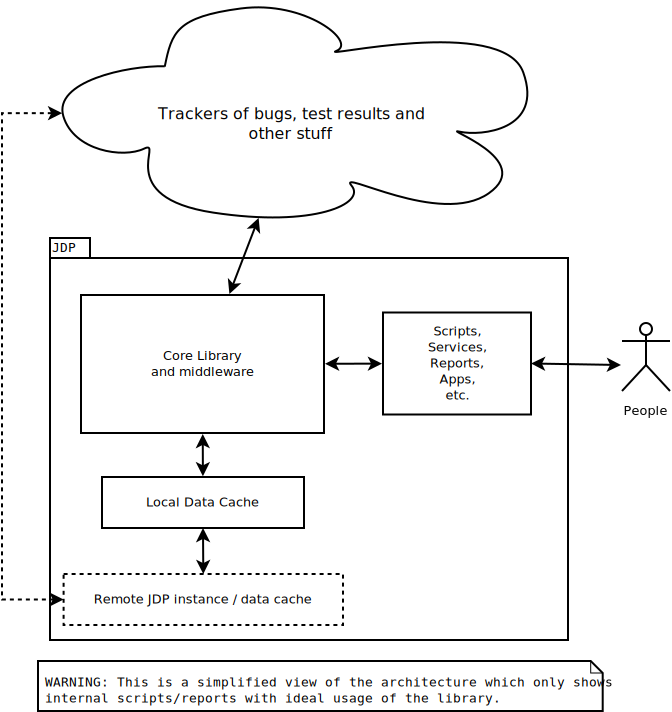

# JDP

In simple terms; JDP makes creating test result reports (amongst other things)
easy.

In less simple terms, JDP is an Extensible, sometimes automated, test/bug
review and reporting development environment. The broader aim is to *make
prototyping arbitrary reporting and inter-tool workflows cheap* so that
experimentation in this area has a convex payoff.

* JDP may be used as a library in a larger project or as an
  application/service[^1].
* JDP is not a polished product for non-technical users, but you can use it to
  make that.
* JDP makes data from multiple sources/trackers easily accessible, but it is
  [not a source of truth](development/index.html#Not-a-source-of-truth-1).
* JDP can post back to trackers; it can automate workflows other than
  reporting.
* JDP is intended to fit *into* a CI/CD pipeline or take over unusual sections
  of a pipeline, it is not intended as a replacement for Jenkins, GoCD,
  GitlabCI, etc.

Initially JDP is targeted at SUSE's QA Kernel & Networking team's
requirements, however it is a general purpose tool at its core. It could be
used with any type of data for most any type of workflow or reporting.


!!! tip

    This README is best viewed through the [docs site](https://rpalethorpe.io.suse.de/jdp/) ([public
    mirror](https://richiejp.github.io/jdp/)).
    Otherwise *admonition blocks* like this will be misinterpreted as literal
    blocks.

[^1]:

    In the sense that the JDP project comes bundled with some scripts for
    using it with Jupyter amongst other things.

# Install

The goal is to do this in a single command, but for now it takes a few
more.

!!! note

    SUSE employees and associates should view this at:
    [gitlab.suse.de/rpalethorpe/jdp](https://gitlab.suse.de/rpalethorpe/jdp)

## Docker

You can install using Docker by doing the following from the directory where
you cloned this repo. This is probably the easiest way if you just want to
quickly try it out.

```sh
docker build -t jdp:latest -f install/Dockerfile .
```

Or you can substitute the build command for the following which will get a
pre-built image from hub.docker.com (it may not be up to date).

```sh
docker pull suserichiejp/jdp:latest
```

Then you can inject the access details for the data cache server if you have
them. Using the data cache can save a lot of time.

```sh
docker build -t jdp:latest -f install/Dockerfile-slave \
             --build-arg REDIS_MASTER_HOST=ip-or-name \
             --build-arg REDIS_MASTER_AUTH=password .
```

!!! note

    If you pulled from dockerhub (or wherever) then you will need to change
    the tag name to suserichiejp/jdp:latest (or whatever).

Then run it
```sh
docker run -it -p 8889:8889 jdp:latest
```

With a bit of luck you will see a message from Jupyter describing what to do
next. The Docker image also contains two volumes which you may mount. See the
Dockerfile for more info.

You can use the Docker image for developing JDP itself by mounting the `src`
volume. However this is probably not a good long term solution.

## Other

You can use install/Dockerfile as a guide. Also check `conf/*.toml`.

You can run JDP directly from the git checkout. Just install the deps listed
in the Dockerfile and modify the conf files (which should include there own
documentation).

# Usage

## With Jupyter

If you are using the Docker image then just browse to
[localhost:8889](http://localhost:8889). If not then start Jupyter yourself.

Open either the `notebooks/Report-DataFrames.ipynb` or `notebooks/Propagate
Bug Tags.ipynb` Jupyter notebooks which are (hopefully) self documenting. I
have only tested them with Jupyter itself, but there are fancier alternatives
such as JupyterLab and, of course, Emacs.

## Other

You can also use the library from a Julia REPL or another project. For example
in a julia REPL you could run

```julia
include("src/init.jl")
```

Also the `run` directory contains scripts which are intended to automate
various tasks. These can be executed with Julia in a similar way to `julia
run/all.jl`.

## Automation

JDP is automated using SUSE's internal Gitlab CI instance. Which automates
building and testing the containers as well as deployment and the execution of
various scripts/services. See `install/gitlab-ci.*`.

# Documentation

Further documentation can be found at
[richiejp.github.io/jdp](https://richiejp.github.io/jdp) or
[rpalethorpe.io.suse.de/jdp](https://rpalethorpe.io.suse.de/jdp)

You can also find documentation at the Julia REPL by typing `?` followed by an
identifier or in a notebook you can type `@doc identifier` in a code cell.

The following image may give you some intuition for what JDP is.



# Contributors

Created and maintained by Richard Palethorpe (rpalethorpe@suse.com). Sebastian
Chlad (schlad@suse.com) is mainly responsible for it being a serious (I hope)
project.

Cyril has been asking for a result difference view and matrix for years.

## Ideas and feedback

Because it is not obvious who has contributed non-code or documentation
changes I will try to make a list. Please let me know if I have missed you
out or want to be removed.

* Sebastian Chlad
* Cyril Chrubis
* Yong Sun
* Anton Smorodskyi
* Sergio Lindo
* Petr Vorel
* Oliver Kurz
* Clemans Famulla-Conrad
* Jose Lausuch
* Petr Cervinka

## Code and documentation

See the github/lab stats.
